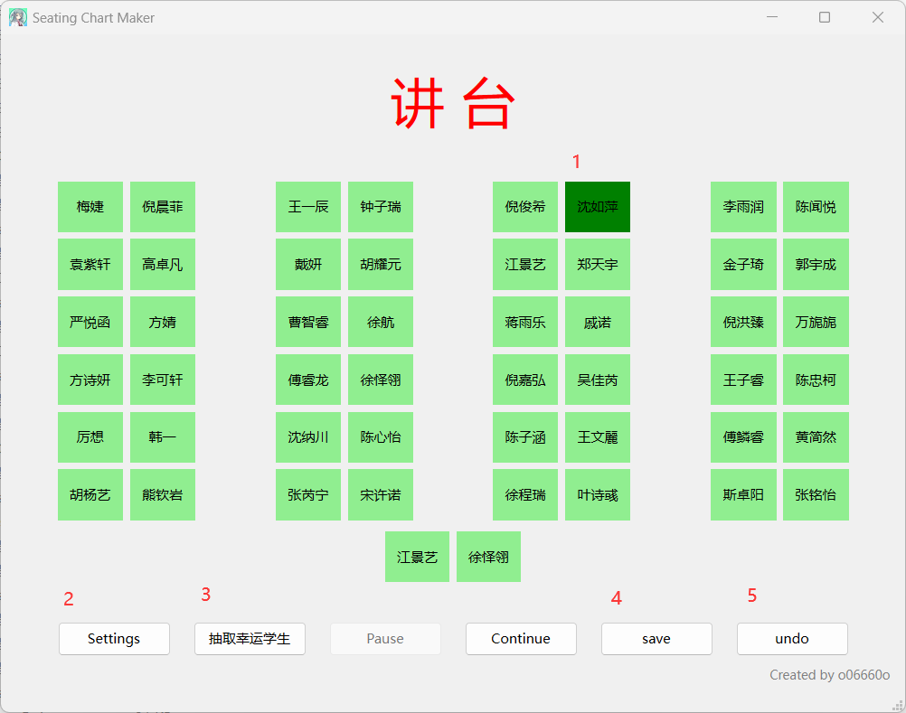

# Seating Chart Maker

帮助班级实现随机抽取座位的软件

## 如何操作

### 主界面

1. 选中第一排或第六排的同学可以互换座位
2. 打开修改设置的窗口(其实可以直接改setting.json)
3. 杨老师可能会用这个软件来抽取几名学生上黑板答题, 这个按钮可以打开抽取学生的窗口
4. 将当前座位截图保存, 路径在./screenshots/
5. 撤销选中的同学

### 修改设置

需要注意相邻两个数据用英文逗号连接

### 抽取学生

抽取十名学生时, 点击表格中任意格子, 可以替换该格子里的学生
