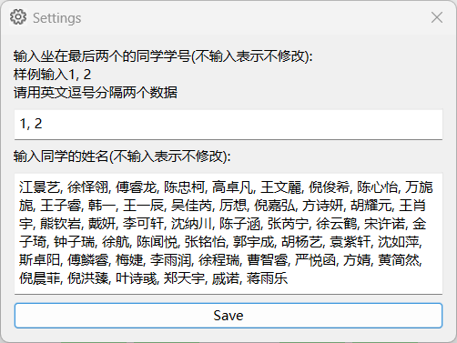

# Seating Chart Maker

帮助班级实现随机抽取座位的软件

## 如何操作

### 主界面

1. 打开修改设置的窗口(其实可以直接改setting.json)
2. 杨老师可能会用这个软件来抽取几名学生上黑板答题, 这个按钮可以打开抽取学生的窗口
3. 暂停中间48位学生的抽座位
4. 继续中间48位学生的抽座位
5. 最后两个位置应该在抽座位开始前就订好了

### 修改设置

需要注意相邻两个数据用英文逗号连接, 不要加空格

### 抽取学生

1. 点击抽取一名学生
2. 点击抽取十名学生
3. 点击表格中任意格子, 可以替换该格子里的学生

## TODO

- 修改设置时显示原来的设置, 或者将修改设置过程更直观的展示出来
- 缩放主界面时里面组件也能一起缩放
- 可以截取已经抽取的座位并保存
